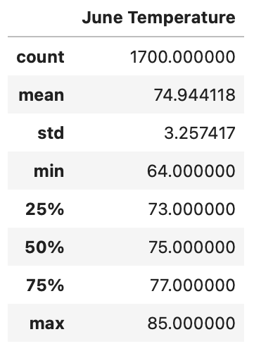

# surfs_up

SQLite

## Project Overview

The purpose of this analysis is to help W. Avy a surfer and investor decide if it is reliable to open an ice-cream and surf shop on the island of Oauh. This analysis will show the climate history and some patterns to W. Avy so he can make decisions on his bussiness. The data is based on the past years 2010 - 2017 specifically June and December.

## Results 

* Summary statistics of June 

* Summary statistics of December 

