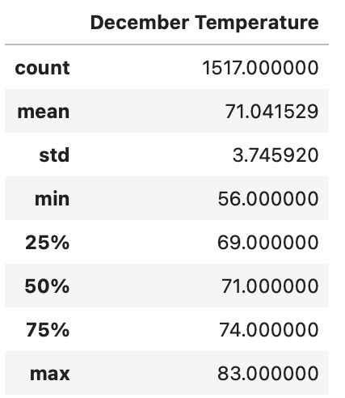

# surfs_up

SQLite

## Project Overview

The purpose of this analysis is to help W. Avy a surfer and investor decide if it is reliable to open an ice-cream and surf shop on the island of Oauh. This analysis will show the climate history and some patterns to W. Avy so he can make decisions on his bussiness. The data is based on the past years 2010 - 2017 specifically June and December.

## Results 

* Summary statistics of June 

* Summary statistics of December 

* December temperatures is more variable than June information.
* Average temperature is 72 °F.
* Maximun temperatures in both months are very similar 85°F for June and 83°F for December.

## Summary 

Although the temperature seems to be more variable in December it can be said that the temperature along the whole year is very estable with max and min values, also the chances of continuous rainfall are low so this will tell W. Avy that the Oauh island is a warm place to open a Surf and Ice cream shop. In order to get more reliable data additional queries need to be done.
